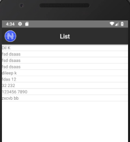
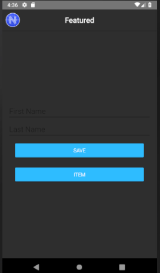
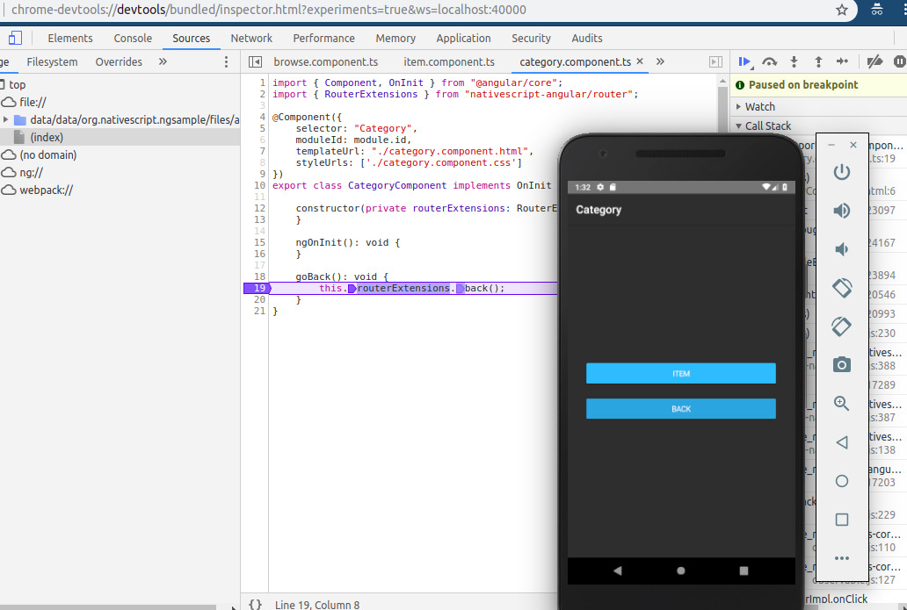
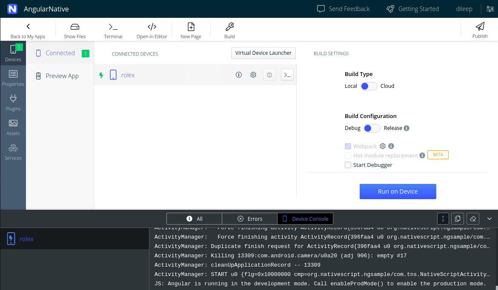
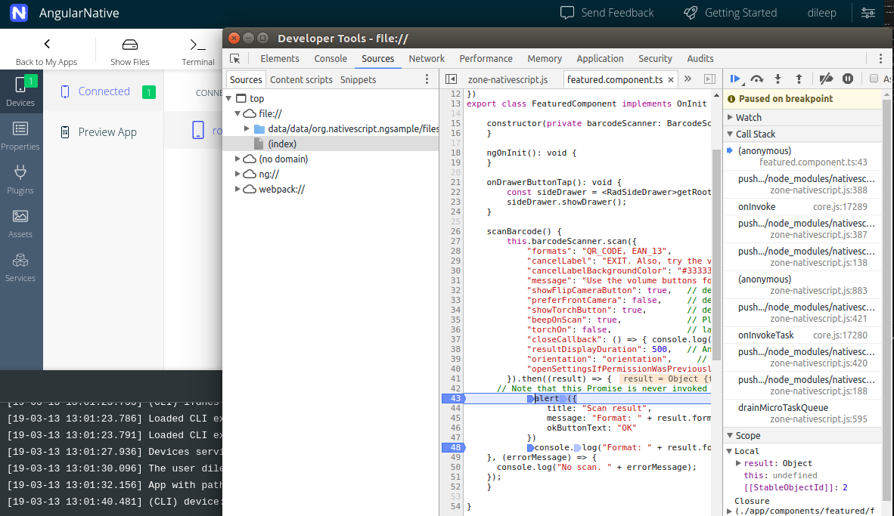

# AngularNative

This project was generated with [Angular CLI](https://github.com/angular/angular-cli) version 7.3.0.

## Development server

Run `ng serve` for a dev server. Navigate to `http://localhost:4200/`. The app will automatically reload if you change any of the source files.

## Running Native Mobile App (Android)
Run `tns run android --bundle`
To Deploy on Emulator need to have a [full setup checkout](https://docs.nativescript.org/angular/start/cli-basics#full-setup-using-run)

Else install Nativescript Playground & Preview App's from playstore checkout [Quick setup](https://docs.nativescript.org/angular/start/cli-basics#quick-setup-using-preview)

## Code scaffolding

Run `ng generate component component-name` to generate a new component. You can also use `ng generate directive|pipe|service|class|guard|interface|enum|module`.

## Build

Run `ng build` to build the project. The build artifacts will be stored in the `dist/` directory. Use the `--prod` flag for a production build.

## Debug

To debug run `tns debug android --bundle` which will generate a link some thing like `chrome-devtools://devtools/bundled/inspector.html?experiments=true&ws=localhost:40000`, navigate to the link and put debug points. On navigation in the android app it will hit the debugger.

Reference: 
1) [Debugging in chrome](https://docs.nativescript.org/tooling/debugging/chrome-devtools)
2) [Debugging in Visual studio](https://docs.nativescript.org/tooling/visual-studio-code-extension)

## Run App on Device & Debug

1) [Install Sidekick](https://docs.nativescript.org/angular/sidekick/intro/installation)
2) Enable `Developer options` in the device then enable `USB debugging`,`Install via USB`
3) Run the app on connected device by clicking `Run on Device`
4) To debug select `sourceMap` at Webpack and check `Start Debugger` then click on Debugg button at connected Devices list, which will open up a window that allowss you to put breakpoints.

Reference:
1) Run on Device - Sidekick(https://docs.nativescript.org/angular/sidekick/getting-started/run-on-device)
2) Debug on Device - SideKick(https://docs.nativescript.org/angular/sidekick/user-guide/run-app/debug-app)

## Running unit tests

Run `ng test` to execute the unit tests via [Karma](https://karma-runner.github.io).

## Running end-to-end tests

Run `ng e2e` to execute the end-to-end tests via [Protractor](http://www.protractortest.org/).

## Further help

To get more help on the Angular CLI use `ng help` or go check out the [Angular CLI README](https://github.com/angular/angular-cli/blob/master/README.md).

